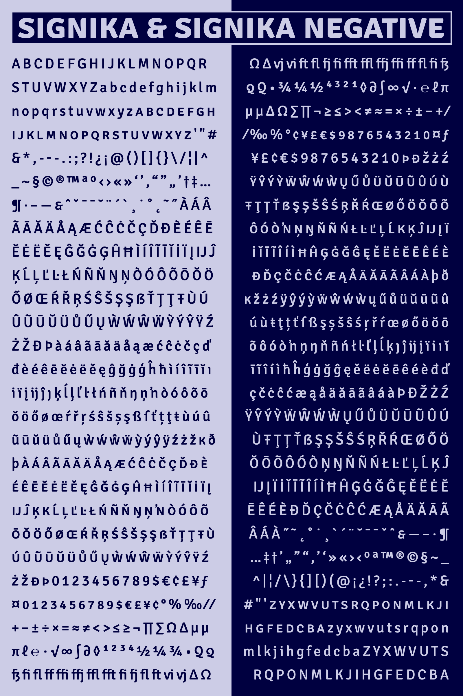

# Signika

A variable font for positive/negative typesetting, originally designed by Anna Giedryś in 2011.

<details>
<summary>Build Instructions</summary>

# Build Process

The sources can be built with FontMake, but I've put together some specific build scripts to pass the fonts through some steps that fix metadata issues.

## Step 1: Install Requirements

To operate the scripts within this repo, install requirements with:

```
pip install -r sources/scripts/requirements.txt
```

(Caveat: this installs all Python 3 dependencies I've installed for Google Fonts work. I know this is messy – next time, I'll set up a virtual environment for each project. I hope to circle back in the future and make this requirements file cleaner. If you wish to install fewer requirements, you could alternatively install requirements when/if you run into errors.)

## Step 2: Give permissions to build scripts

The first time you run the build, you will need to give run permissions to the build scripts.

On the command line, navigate to the project folder (`cd Encode-Sans`), and then give permissions to the shell scripts with:

```
chmod -R +x sources/scripts
```

The `-R` applies your permission to each of the shell scripts in the directory, and the `+x` adds execute permissions. Before you do this for shell scripts, you should probably take a look through their contents, to be sure they aren't doing anything bad. The ones in this repo simply build from the Encode Sans GlyphsApp sources.

## Step 3: Run the build scripts!

You can then build sources by running shell scripts in `sources/scripts/`.

Build the full variable font (Weight + "Negative" axes) with:

```
sources/scripts/build -f
```

Build the split variable font with (just Weight axis for "normal" version):

```
sources/scripts/build -n
```

Build all static instances with:

```
sources/scripts/build -s
```

# Build steps after edits to primary source

This project has a "primary" source file which has received design updates and steps of outline QA. However, the designspace of this primary source is setup in such a way that it is not possible to export directly from it to a variable font, via FontMake. This is because it has just two weight masters, but exports to a 2-axis design, with a "Negative" axis that is derived from a smaller shift to the overall weight of fonts (similar to a Grade axis, but without maintaining a fixed width for letters).

Due to [current limitations in remote scripting for GlyphsApp](https://forum.glyphsapp.com/t/instance-as-master-through-core-api/10502/12), if you wish for edits to the design to cascade into the final outputs, you must use a partially-manual build process, wherein a few processing steps are done to make "build-ready" sources. These steps are as follows, in GlyphsApp:

1. Add `sources/scripts/helpers/prep-designspace-glyphs_script.py` to your Glyphs Scripts folder as a symlink with `ln -s YOUR_PATH/sources/scripts/helpers/prep-designspace-glyphs_script.py GLYPHS_SCRIPTS_PATH/prep-designspace-glyphs_script.py`

2. Open the main source (`sources/Signika-MM.glyphs`) in Glyphs. Run the prep-designspace script.

The font now has sources with build-ready rectangular designspace, and will build into a variable font with the build scripts.

</details>

<details>
<summary>Variable font upgrade notes</summary>

# Project notes

Notes were taken throughout the variable font upgrade project and added to the [docs](/docs) directory. I tend to take notes while working anyway, in order to think through problems and record solutions for later reference. In this project, I have included these in the repo so that others might find references to solve similar problems, especially because variable font-making processes are relatively new, and there is a general scarcity of online knowledge on font mastering. Because they were often made alongside work, the notes can at times be a bit disjointed. Hopefully they are still helpful to others! 

If you have any questions about the project or the notes, feel free to [file an issue](/issues) or to reach out to Stephen Nixon via Twitter ([@thundernixon](https://twitter.com/thundernixon)) or other social media (typically also @thundernixon).

</details>

---

