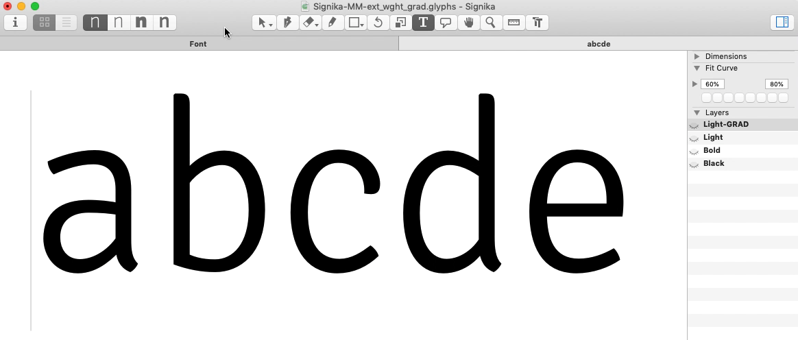

# Making a "proper" GRAD Axis

As the previous doc says, a Grade axis should keep widths and prevent reflow. According to Mozilla Dev Network:

> The term 'grade' refers to the relative weight or density of the typeface design, but differs from traditional 'weight' in that the physical space the text occupies does not change, so changing the text grade doesn't change the overall layout of the text or elements around it.

— [Grade, MDN](https://developer.mozilla.org/en-US/docs/Web/CSS/CSS_Fonts/Variable_Fonts_Guide#Grade)

Signika and Signika Negative have a problem: they don't currently share text width, even though they should. This prevents grade from being used in a truly useful way on the web, where the primary function is likely to be making light/dark UI changes a possibility.

## Goals

1. Make a variable Grade axis happen _without_ reflow, starting by keeping the same weight relationships as the status-quo files (and possibly experiment with adjusting this).
2. Ideally, make the Grade axis happen with just _one_ additional master, to keep font weight down. This may be doable, because the point deltas for grade are so small.

## Approach

1. Taking the `Negative Light` instance, which had a wght value of `-15`, and converting it to a master

2. Using a script to copy glyph metrics from the `Light` master to the `Negative Light` master, to hopefully make point deltas only adjust grade, not overall glyph width, etc

1. Generating a VF and testing the result on bold weights
