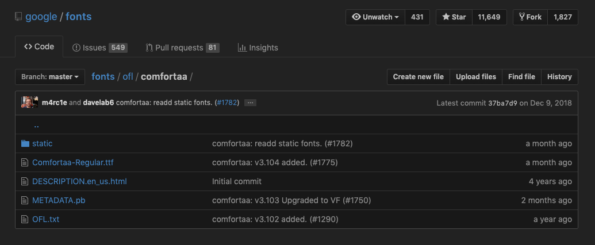

# Exporting for Pull Request

- [x] make build scripts for:
  - [x] a full VF
  - [x] split VF families into a positive and negative versions
  - [x] static families

- [x] delete unnecessary folders/files/experiments

- [x] make/add metadata files

- [ ] check naming
- [ ] run through fontbakery

- [x] make PR
  - [x] make branch of google/fonts repo (making sure this matches current gf master branch)
  - [x] add new font files of Signika
  - [x] push up to GitHub & start PR

- [ ] QA outlines with Red Arrows & FontAudit
- [ ] correct NAME/STAT tables in full variable font

- [ ] fix `/Germandbls` (currently this is just using a lowercase letter as a component, rather than being a proper uppercase /Germandbls)

## PR structure

Like [Comfortaa](https://github.com/google/fonts/tree/master/ofl/comfortaa)

Each font family (e.g. signikanegativesc) should have a split VF at the top level, and a folder for `/static` fonts.

