# Diffing against old (currently hosted) files

Currently, vertical metrics are the most-noticeable difference between newly-built files of Signika and the old versions currently hosted on Google Fonts. (If I'm reading this correctly), the new versions have metrics that are significantly taller than before:

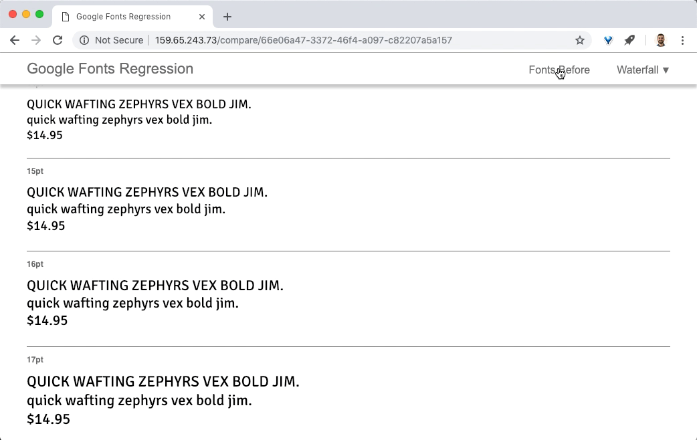

Using font-line, I can easily compare the vertical metrics of the new and hosted versions. Here's an example of the current state: http://159.65.243.73/compare/66e06a47-3372-46f4-a097-c82207a5a157

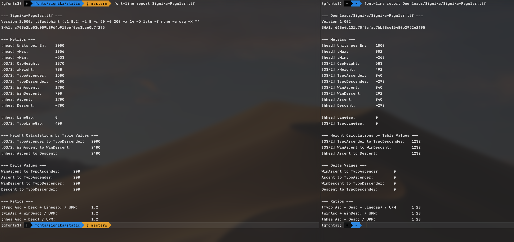

The UPM of Signika is now 2000 rather than the original 1000, so all values on the left are doubled from what they would otherwise be. Google Sheets makes it easy to compare this:

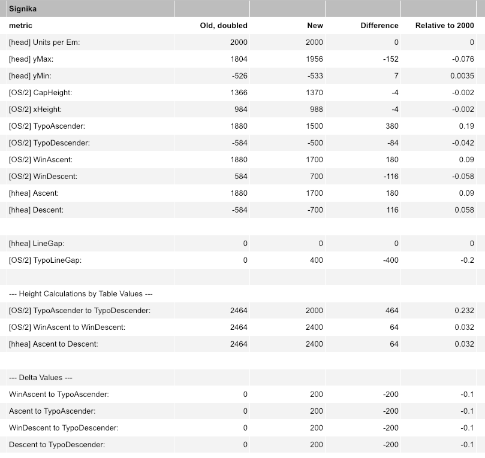

However, aside from this, they should probably match the hosted vertical metrics (almost) exactly to prevent websites from breaking. Luckily, font-line gives a simple comparison of the overall line height: the `Ratios` which are `1.2` in the new fonts, and `1.23` in the old fonts.

My hunch is that the ratio difference of `0.03` is linked to the Ascent to Descent difference of `0.032`. If my intuitive math is right, my main task is finding where to add about 64 units to the height of Signika.

But, how should I go about matching the old versions? First, I'll match [Marc Foley's recommendation for vertical metrics](https://github.com/googlefonts/fontbakery/issues/2164#issuecomment-436595886). Then, I will adjust these as needed to match the line heights of the old fonts, when viewed on the web and ideally also in word processors. The recommended vertical metrics are:

- TypoAscender and hheaAscender are set to height of tallest Cap glyph with single accent (Â, Å)
- Linegaps set to 0
- TypoDescender and hheaDescender set to lowest a-z letter (p, j, q)
- Win Ascent and Win Decent set to yMax and yMin
- fsSelection bit 7 enabled
- Vertical metrics on average were around 130% of upm. I felt this number was the sweet spot. Anything greater and the metrics just looked too loose.

After using a script to set these items, I've realized that yes, the font needs exactly 64 units, because the line height ratio is being calculated by hhea & OS/2 ascent-to-descent metrics. The old one was (when doubled) 2464, and the new was 2400. After implementing Marc's recommendations, the ascent-to-descent is 2446, or 18 units short. So, I (probably) need to find how much of this extra space to add to the ascent & descent to match the overall metrics of the font before. *AND* actually that is probably quite simple: doubled, the old ascent was `1880` and the old descent was `-584`. My just-adjusted vertical metrics (from Marc's recommendations) have an ascent of `1870` and a descent of `-576` – or a total of 18 units fewer than the older version. I'll change those metrics, and (I think) it will probably match exactly.

Whereas the metrics got to a computed place with a Glyphs Script, I'll now just use a quick macro to set them: `sources/scripts/helpers/set-vert-metrics.py`.

...comparing in Font Diffenator again: it works! 🎉

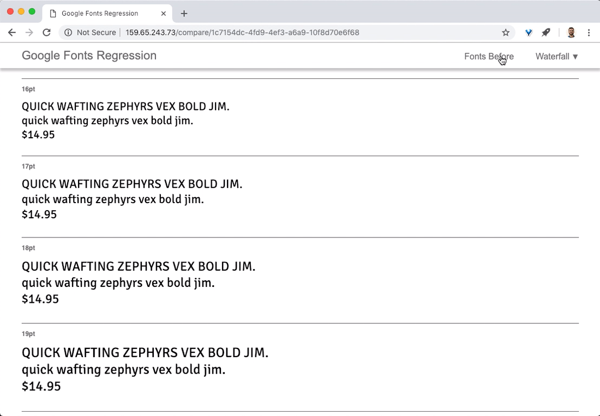

---

- Win Ascent and Win Decent set to yMax and yMin
- Linegaps set to 0
- TypoAscender and hheaAscender are set to height of tallest Cap glyph with single accent (Â, Å)
- TypoDescender and hheaDescender set to lowest a-z letter (p, j, q) 
- fsSelection bit 7 enabled (use type metrics is True)

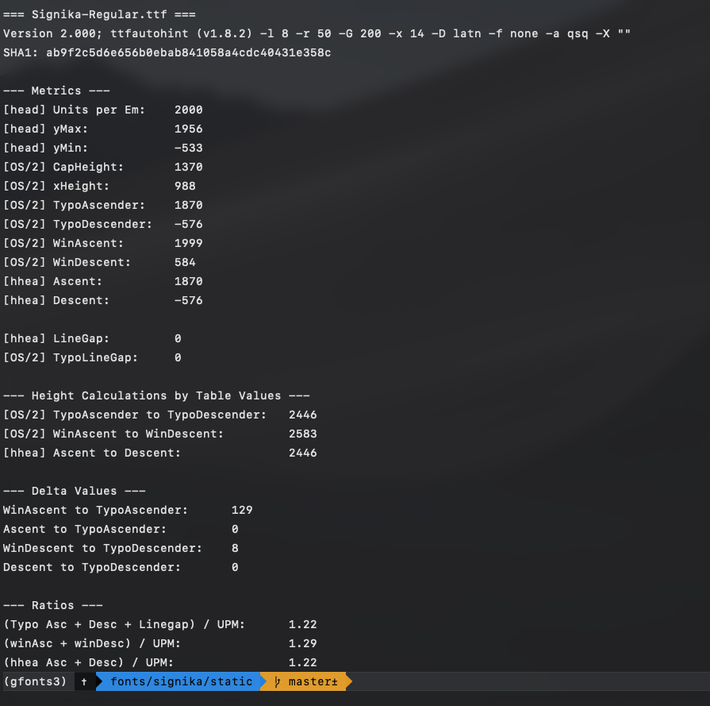

## Hinting, before/after

A current FontBakery fail is:

> **FAIL** TTFAutohint --increase-x-height is 14. It should match the previous version's value (9).

The result on Windows is certainly visible:

http://159.65.243.73/compare/39540841-f87f-40dd-bdaf-c623c5bc9fb1

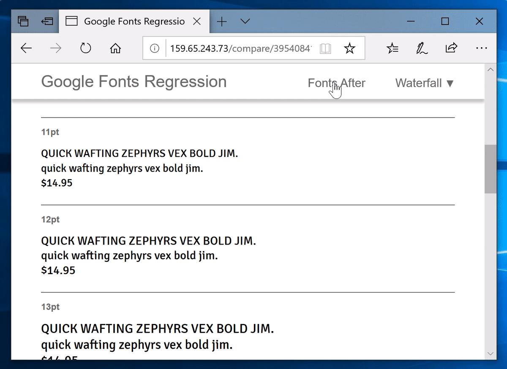

But is it a bad thing? To me, it seems to be more accurately showing a "regular" weight. My guess is, TTFautohint has simply improved since the old fonts were built in 2011.

- [ ] Ask for Micah's opinion

# Missing `/Zcaron` & `/zcaron`?

Marc reported to me that the `/Zcaron` & `/zcaron` outlines are missing in his font diff QA. 

I don't find this to be the case so far in other apps, and I don't (yet) see any reason that this would be happening.

However, one thing this did help me find is that the accents lack `top` anchors, to allow for stacking of accent marks. I'll add these.

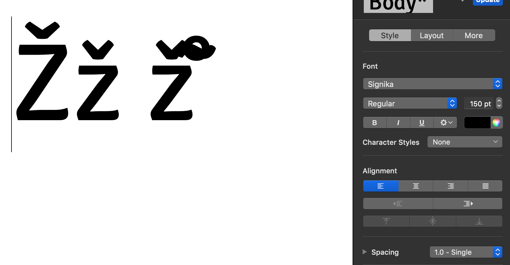

I've now added anchors for accents to stack well. 

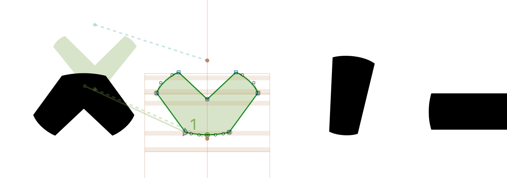

...but actually, the problem seems to be deeper. While I thought that adding anchors would solve it, I'm finding that it hasn't yet been fixed.

Encode Sans, a type family I am always working on, has accents that stack fairly well. This seems to be due to its OpenType feature `ccmp` (Glyph Composition). Additionally, it might have an effect that its `comb` glyphs are the ones given editable outlines and anchors, while non-comb accents are just using components that reference the `comb` ones.

I'll test swapping the `comb` and non-comb outline and component, export, and test.

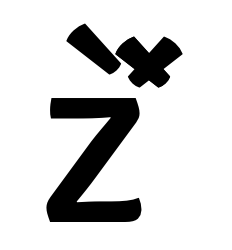

Hmm, not yet. 

Still, I'll start by following the advice in the GlyphsApp [tutorial on diacritics](https://glyphsapp.com/tutorials/diacritics) and make the non-comb accents be the components. This tutorial calls non-comb accents "Legacy" accents, because they are only included to support legacy apps -- new ones use `comb` accents.

<!-- 
To do this, I will make a script to:

1. Give the 0-width `comb` glyphs a width of 796 (this seems to be the standard for Signika)
1. Decompose the `comb` glyphs

I should then be able to use GlyphsApp to easily make the non-comb glyphs. -->

I'll delete the existing `comb` glyphs, as they aren't doing much aside from being 0-width component glyphs. Then, I'll add `comb` to all non-comb accent names. Finally, I'll remake the "legacy" accents from these. While I'm still at GlyphsApp, this all seems to work quite easily -- no component glyphs are losing accents.

So, far, it's a big improvement!

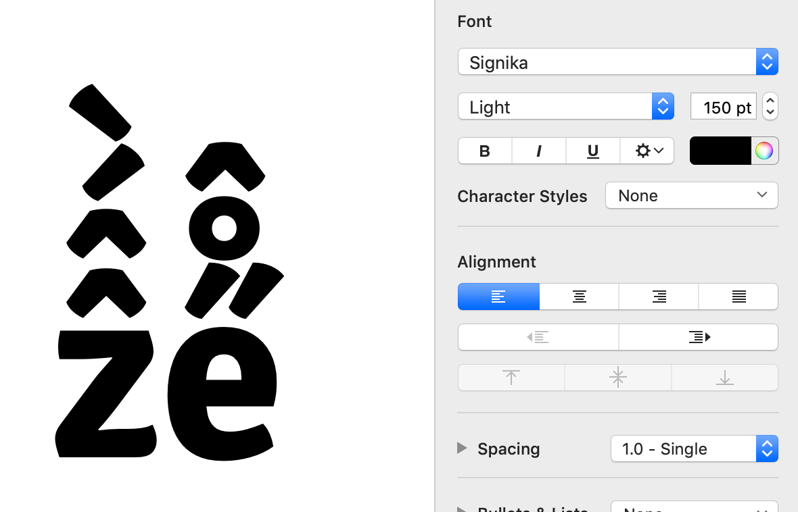

I found that the `tildecomb` wasn't quite working, but this led me to discover that it had a `_top` anchor but was missing a `top` anchor, so I wouldn't attach. 

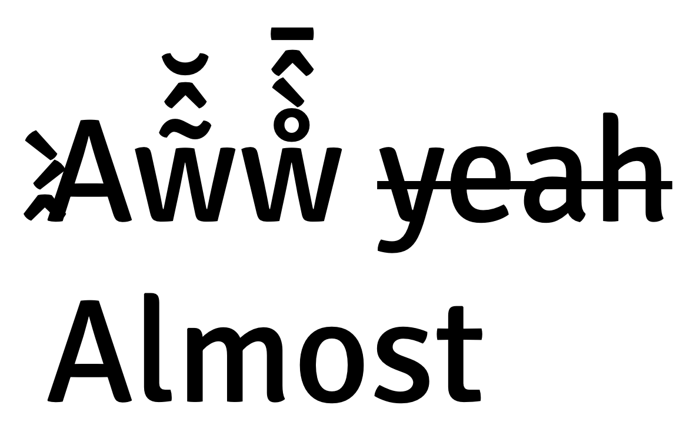

...so close. The caps aren't quite working, yet. I suspect it's because the `.case` accents follow the unusual format of labeling their anchors as `_top_U` and `top_U`. 

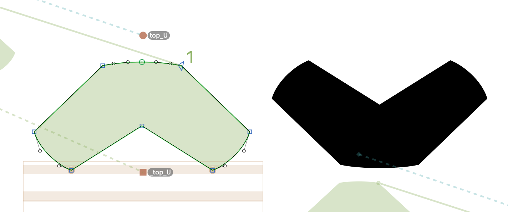

I'll use scripting to change those to normal anchor names, and that should hopefully fix it.

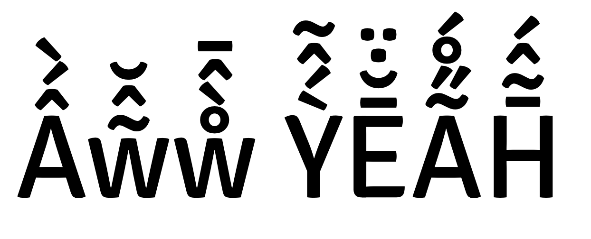

It does!