# QAing glyph outlines & updating /Germandbls form

## Making a true uppercase `/Germandbls`

The previous state of the uppercase `/Germandbls` was that it simply used the lowercase `/germandbls` as a component.

This is understandable, as ideas around the design of a `/Germandbls` have formalized more since Signika's initial design, around 2011. However, it doesn't work very well in all-caps text, so I have drawn a different version of it. I have based this primarily on the `/S`, `/Z`, `/B`, and `/five`.

**Before**

**After**

**Smallcap**

**Adding larger apertures and refining shapes**

In smaller sizes, the openings in the cap & smallcap `/Germandbls` appeared overly-tight. I've opened these up slightly, to more closely reflect the overall open shapes of the lowercase in the font.

**Remove smallcap iteral "double S" smallcap?

There is still a literal "double S" smallcap form of the `/Germandbls`, though it has no uppercase counterpart:

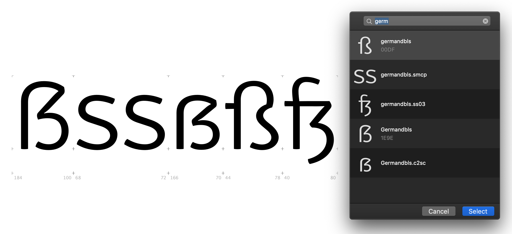

This is a large inconsistency in the font, especially because it doesn't have a match in the uppercase. Checking the currently-published versions of Signika (from 2011), these have the same seeming inconsistency.

I don't want this inconsistency in the final font, but I don't want it to be difficult to add back in later, if needed. 

Steps taken:
- I've turned off the "export" setting on this glyph and check that it is reflected in fonts exported from FontMake
- I've changed the name of the old `/germandbls.smcp` (the literal "SS" form) to `/germandbls.smcp.alt1`, then changed the newly-updated `/Germandbls.c2sc` to `/germandbls.smcp`.
- I've updated the `c2sc` (caps to smallcaps) feature to properly reference the `/germandbls.smcp` rather than the old `/Germandbls.c2sc`

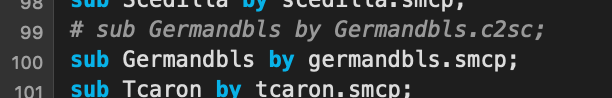

An export test confirms that a non-exporting glyph really does not export via FontMake, in either static or variable outputs:

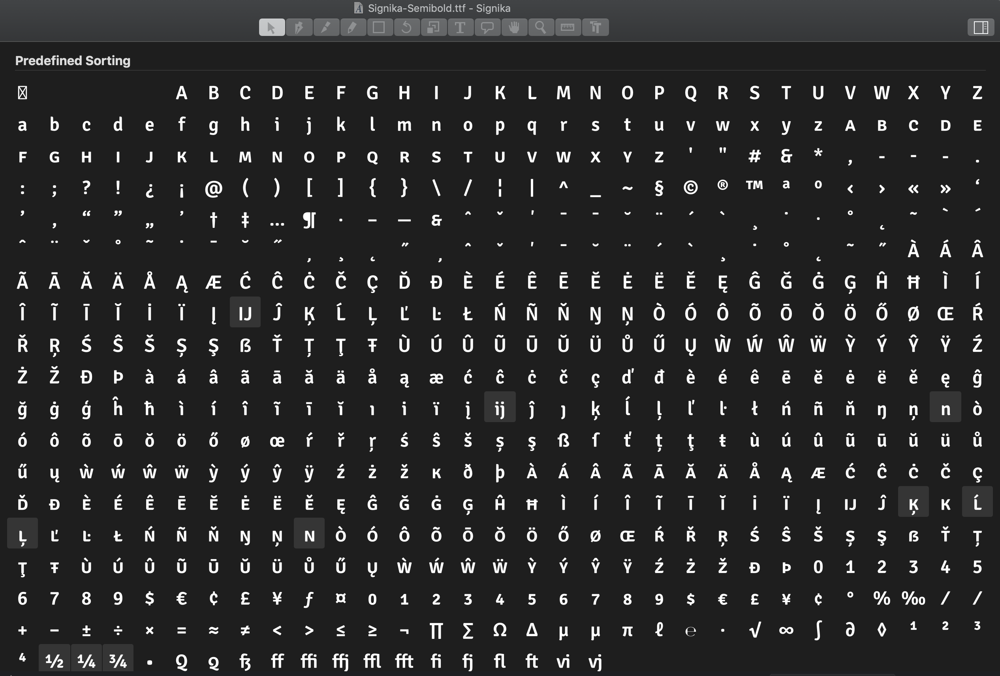

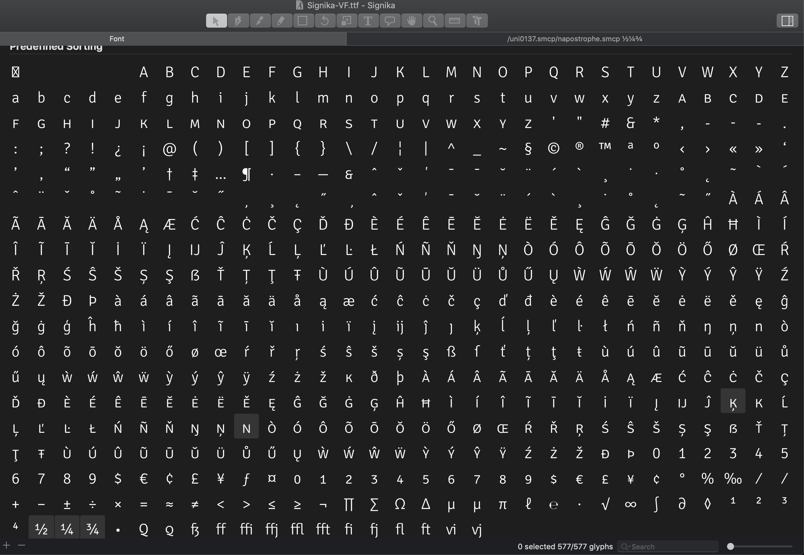

## FontAudit & Red Arrows

**Inflections and Incorrect Smooth Curves are everywhere**

Signika will present a bigger QA challenge than many fonts might, because it has many more slight curves than most fonts. The `/A`, for example, faces outline problems of not-quite smooth curves and inflections. So, even though these curves are exporting in a way that appears to be just fine, there will be many reported issues.

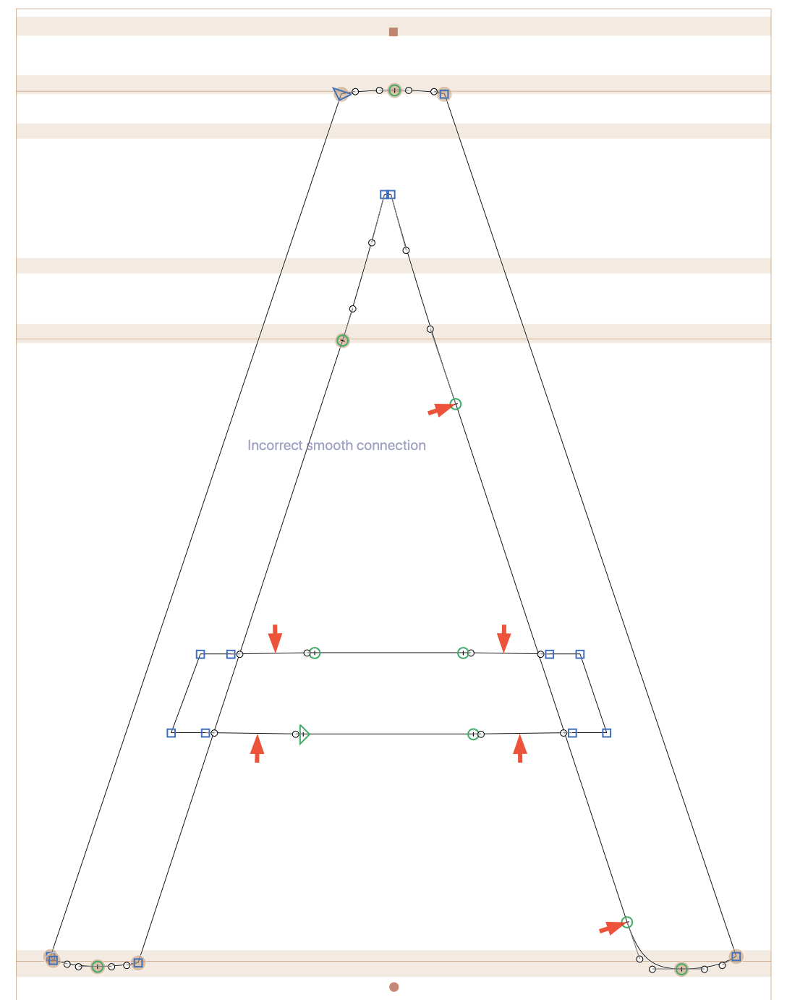

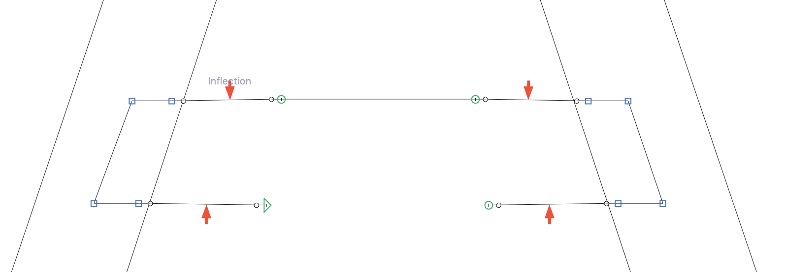

However, these outline issues don't seriously impact the exported TTF variable font:

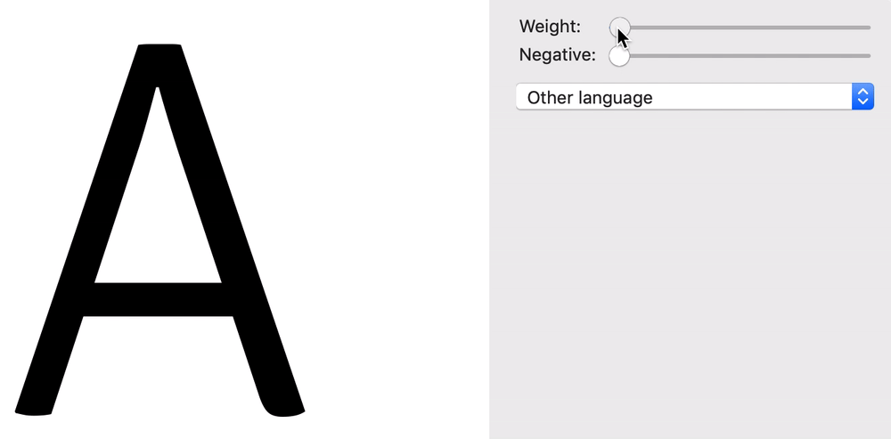

This issue exists all over in Signika, due to its construction of tapering strokes near joints:

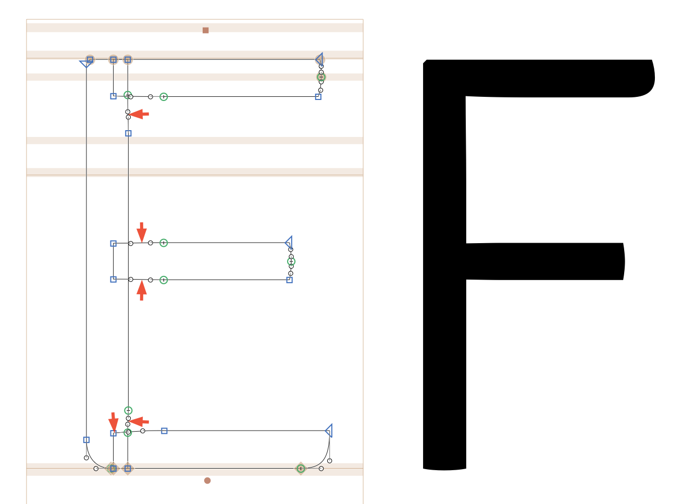

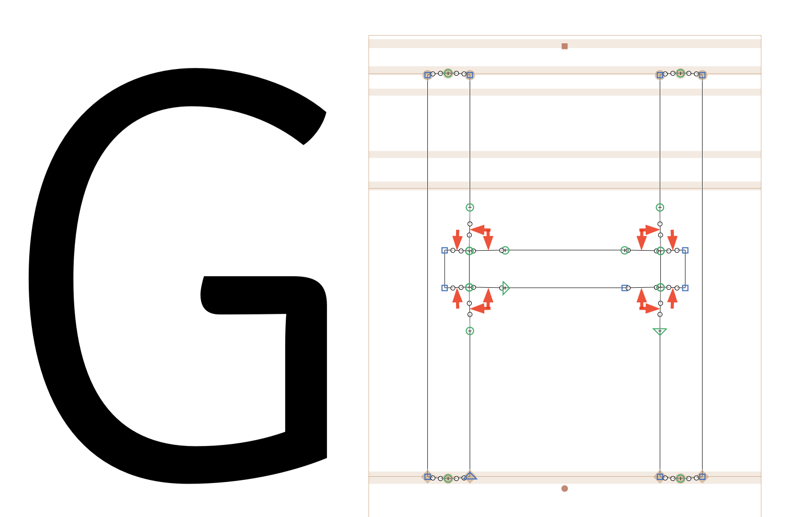

Still, I will fix inflection and incorrect smooth points where they are larger or where they seem more likely to cause trouble. 

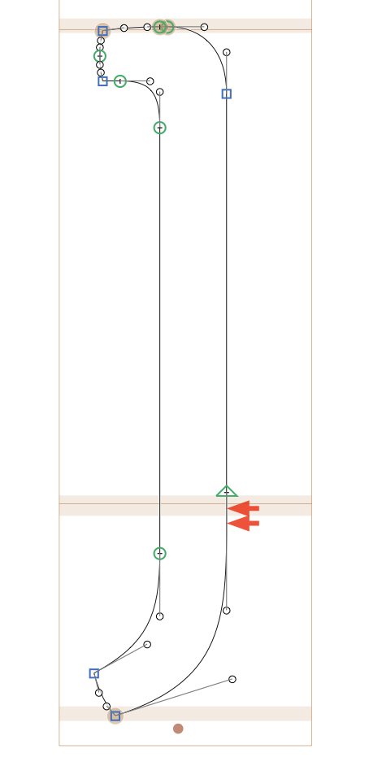
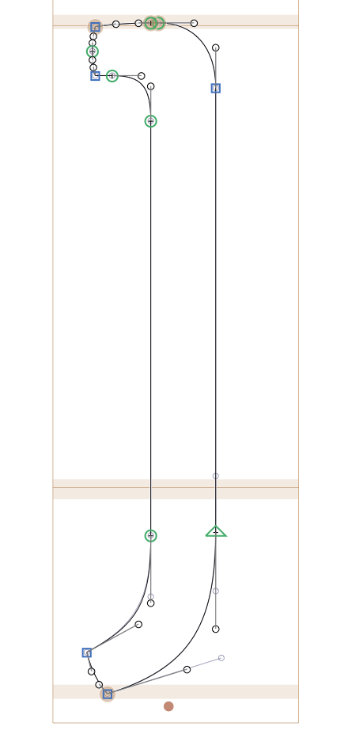

**FontAudit difference: suggested "Remove Points"**

This is a nice feature. Red Arrows only flags this as an "incorrect smooth point," but it's quite unnecessary to the shape of the letter:

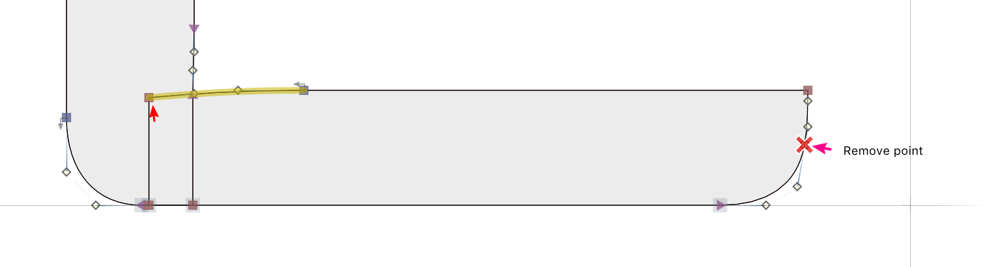

Most of these points can be removed without changing the shapes of rounds. However, narrow forms like the `/zero` are not possible to simplify without changing their shape, because their counters are more square than others.

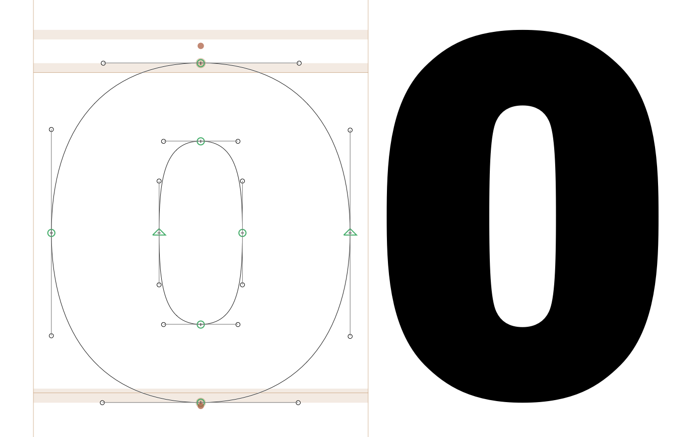
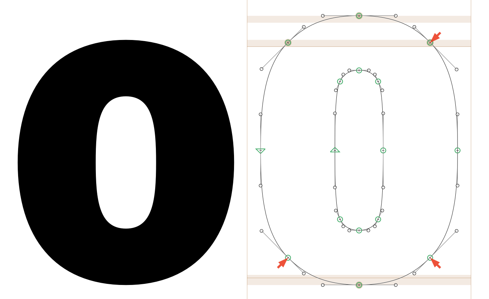

**Making accents symmetrical**

The `/caron` and `/circumflex` were asymmetrical, but not in a particularly intentional-looking way. I've made them symmetrical:

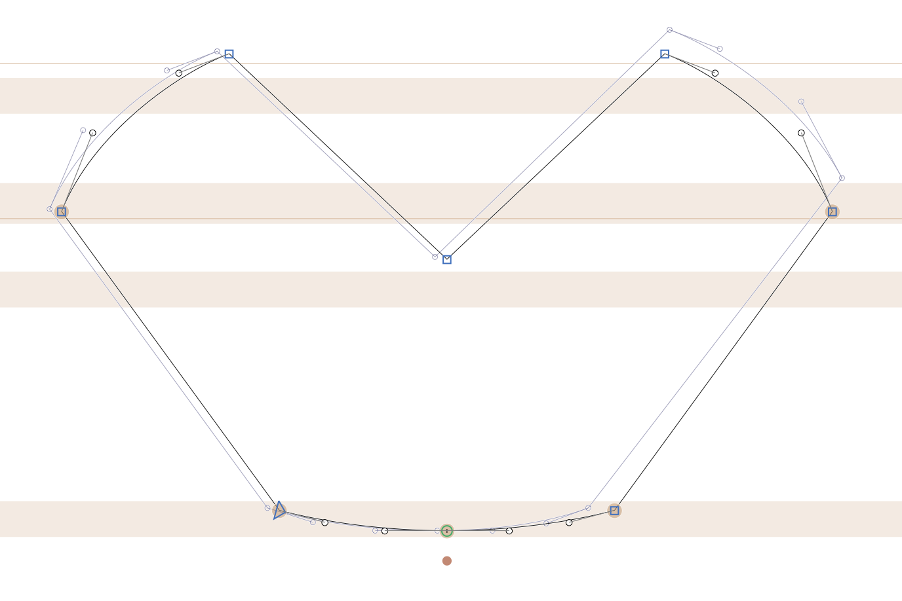

**Preventing kinks**

The `/seven` has a kink, in part due to have many points along its spine. The shape can be kept very similar to its original without so many nodes, and kinks will be less likely.

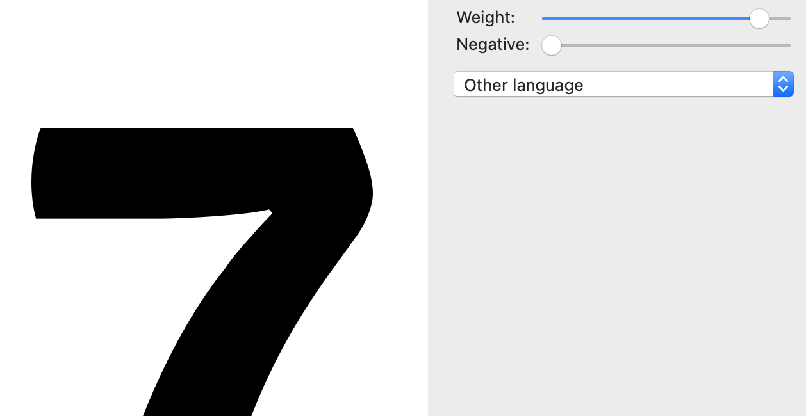

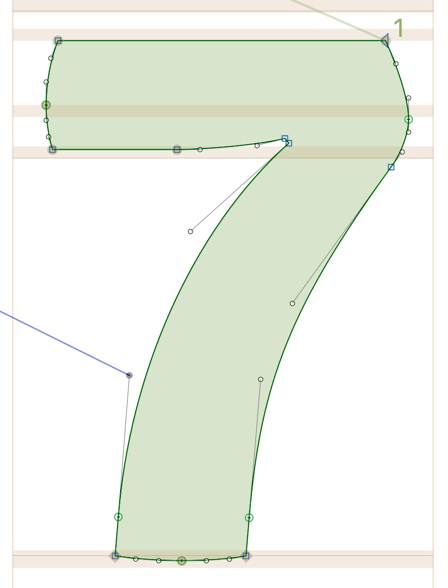

Based on what I can tell, most other curves stay relatively-kink free, as their curve angles change little between weights.

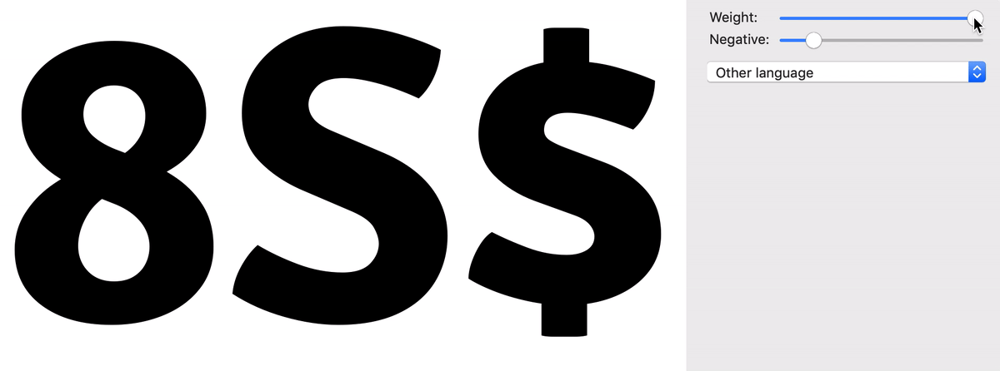