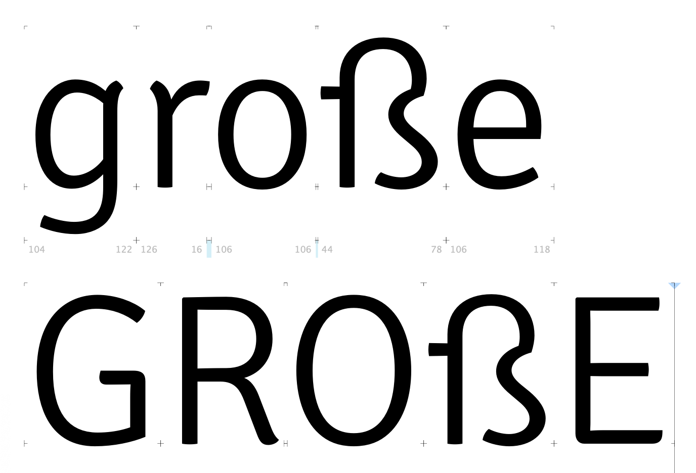
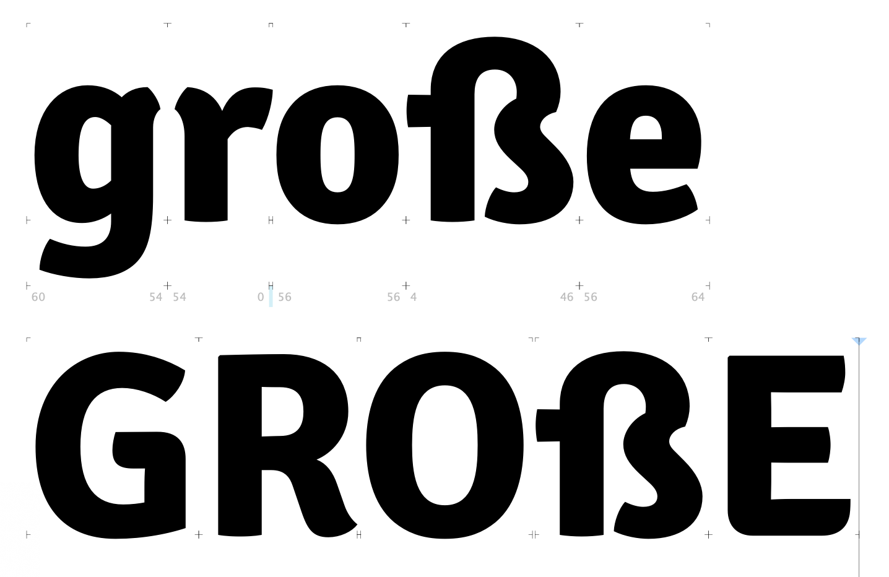
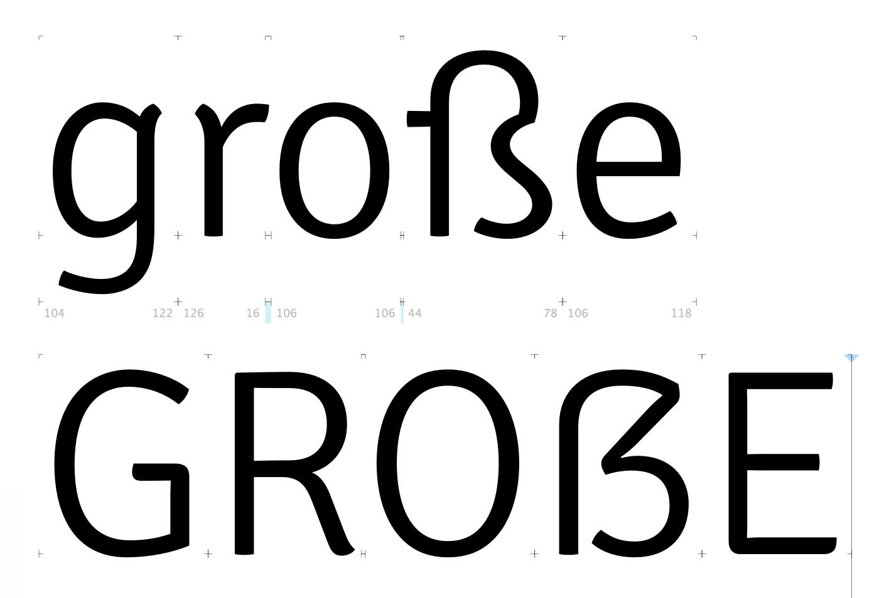
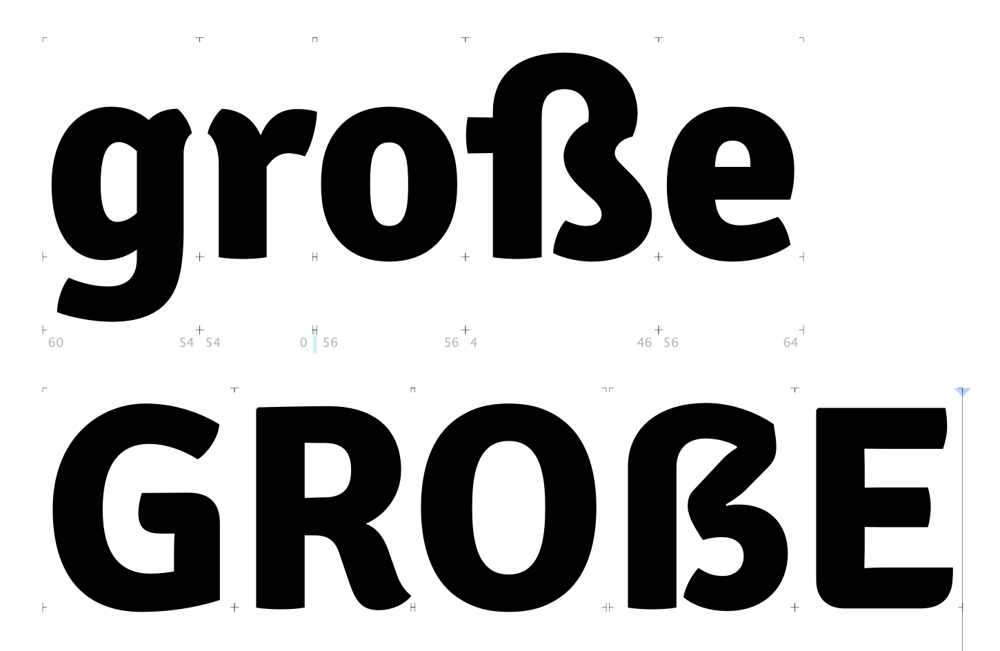
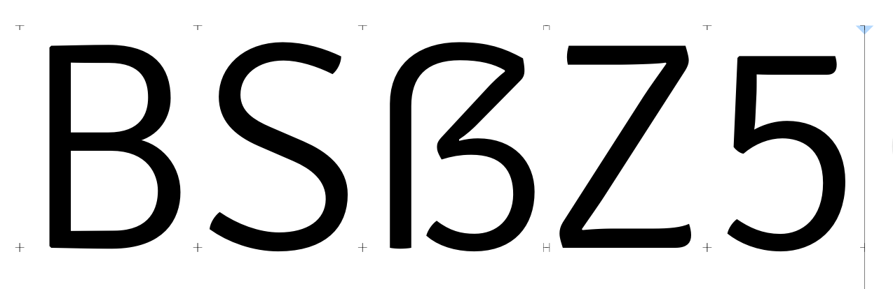
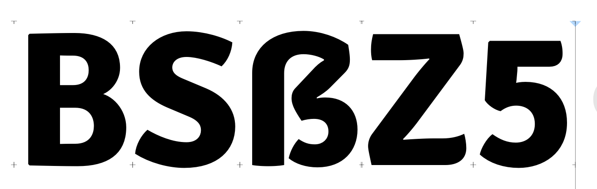
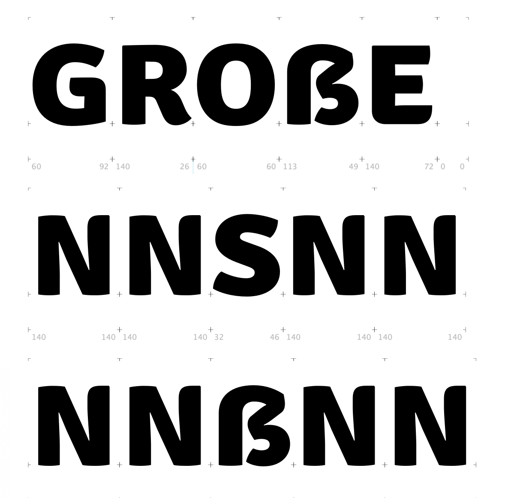
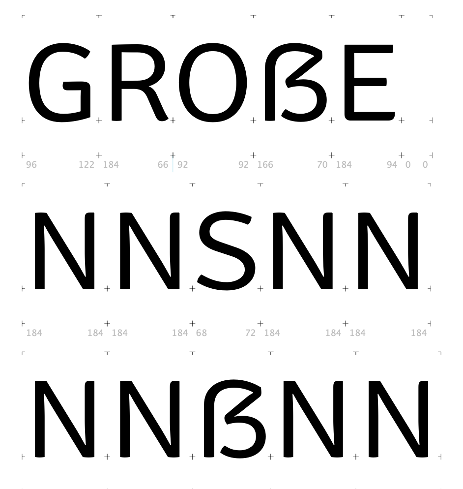
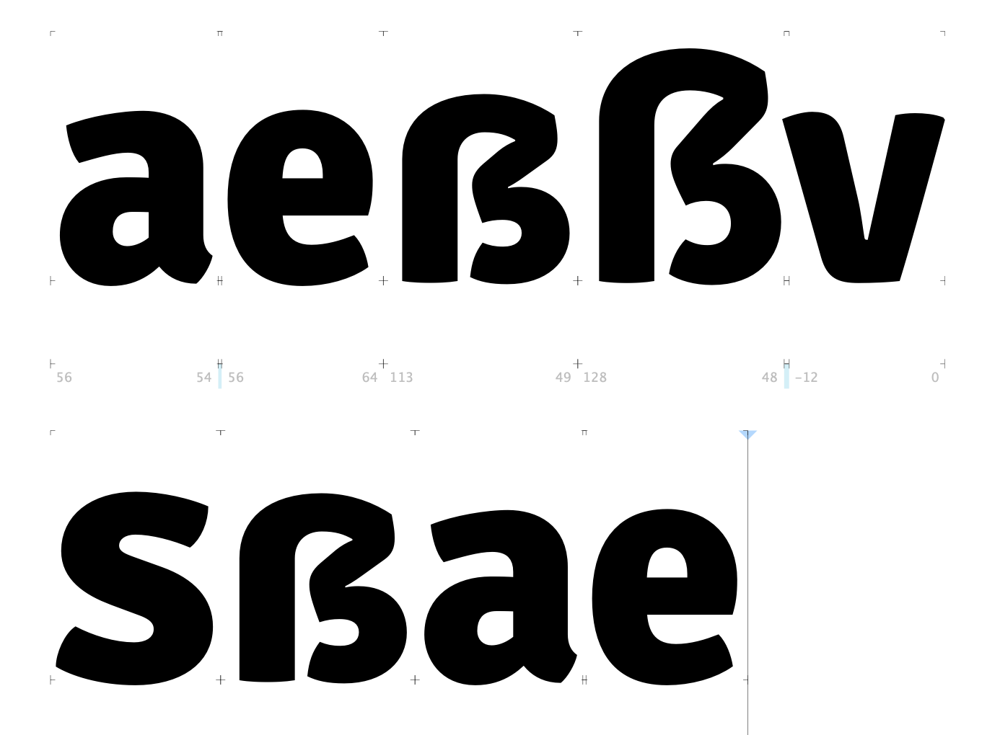
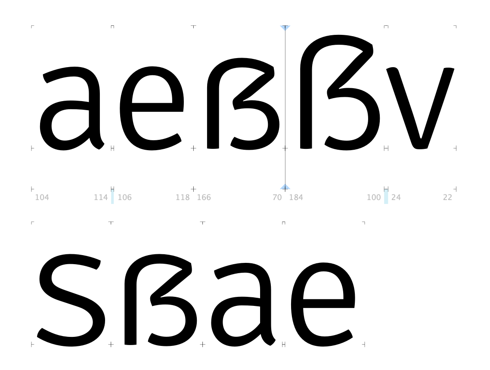

# QAing glyph outlines and build issues

## Making a true uppercase `/Germandbls`

The previous state of the uppercase `/Germandbls` was that it simply used the lowercase `/germandbls` as a component.

This is understandable, as ideas around the design of a `/Germandbls` have formalized more since Signika's initial design, around 2011. However, it doesn't work very well in all-caps text, so I have drawn a different version of it. I have based this primarily on the `/S`, `/Z`, `/B`, and `/five`.

**Before**

**After**

**Smallcap**

**Adding larger apertures and refining shapes**

